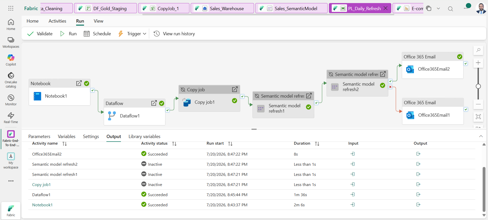

# 🚀 Enterprise End-to-End Analytics Platform using Microsoft Fabric
## Medallion Architecture | Lakehouse | Data Warehouse | Semantic Model | Power BI

**Enterprise Data Engineering & Business Intelligence Project using Microsoft Fabric, PySpark & Power BI**

🚀 A complete Enterprise Analytics Platform built entirely on **Microsoft Fabric**
From Raw CSV Files → Bronze Layer → PySpark Cleaning → Silver Delta Tables → Dataflow Gen2 → Warehouse (Star Schema) → Semantic Model → Executive Power BI Dashboard → Automated Daily Pipeline


<p align="center">
  
</p>

<p align="center"><i>📷 Full architecture diagram — replace with your exported image at <code>Assets/Architecture/Architecture.png</code></i></p>

⭐ **1.5M+ Real Transaction Records** &nbsp;|&nbsp; 🏗️ **Medallion Architecture** &nbsp;|&nbsp; 📊 **8-Page Executive Report** &nbsp;|&nbsp; ⚡ **Zero Data Duplication (OneLake)**

---

## 📑 Table of Contents

- [Project Overview](#-project-overview)
- [Why This Project?](#-why-this-project)
- [Business Problem](#-business-problem)
- [Business Value](#-business-value)
- [Dataset](#-dataset)
- [Repository Statistics](#-repository-statistics)
- [Solution Architecture](#-solution-architecture)
- [Technology Stack](#-technology-stack)
- [Project Workflow](#-project-workflow)
- [Data Profiling & Engineering Decisions](#-data-profiling--engineering-decisions)
- [Data Quality Summary](#-data-quality-summary)
- [Star Schema](#-star-schema)
- [Semantic Model](#-semantic-model)
- [KPIs](#-kpis)
- [Power BI Report — Page by Page](#-power-bi-report--page-by-page)
- [Business Questions Answered](#-business-questions-answered)
- [Automation Pipeline](#-automation-pipeline)
- [Key Skills Demonstrated](#-key-skills-demonstrated)
- [Repository Structure](#-repository-structure)
- [Getting Started](#-getting-started)
- [Future Enhancements](#-future-enhancements)
- [Author](#-author)

---

## 📌 Project Overview

Most data analytics projects rely on disjointed tools (like Python, SQL, and Power BI), leading to data silos, complex maintenance, and data duplication.

This project demonstrates a complete **Enterprise End-to-End Analytics Platform** built entirely on **Microsoft Fabric** to solve these exact challenges. It showcases the true power of a unified data platform by seamlessly integrating:

- **Data Factory** (Data Ingestion & Orchestration)
- **Data Engineering** (Processing with PySpark)
- **Data Warehousing** (Relational Modeling)
- **Business Intelligence** (Power BI & Direct Lake)

By working within a single workspace and utilizing **OneLake**, this solution ensures **Zero Data Duplication**. The data is stored once, and all personas — from Data Engineers to BI Developers — collaborate on the exact same dataset without breaking connections or moving data around.

The solution follows the **Medallion Architecture (Bronze → Silver → Gold)** — taking raw CSV files and transforming them into a fully automated Business Intelligence solution. Built as hands-on preparation for the **DP-600: Implementing Analytics Solutions Using Microsoft Fabric** certification.

---

## 💡 Why This Project?

Unlike traditional Power BI projects that stop at dashboard development, this project demonstrates the **complete enterprise analytics lifecycle** using Microsoft Fabric.

The solution covers every stage of the modern data platform:

- Raw Data Ingestion
- Data Engineering
- Data Quality
- Delta Lake
- Data Warehouse
- Semantic Modeling
- Business Intelligence
- Pipeline Automation

This makes the project suitable for enterprise-scale analytics and closely aligned with Microsoft's **DP-600** certification objectives.

---

## 🎯 Business Problem

Large e-commerce businesses generate hundreds of thousands of transactions across customers, orders, payments, sellers, and logistics — and raw CSV exports alone cannot answer the questions the business actually needs answered:

- What are the best-selling products and categories, and who are the top-performing sellers?
- Which states generate the highest revenue, and how does delivery performance vary geographically?
- Which customers purchase repeatedly, and what drives retention?
- How reliable is delivery performance, and where does it break down?
- Which payment methods dominate, and how do installment plans behave?
- How satisfied are customers, based on review scores and written feedback?

Answering these reliably — and keeping the answers current every day without manual work — requires a proper analytics platform, not a one-off spreadsheet analysis. That is the gap this project closes.

---

## 💼 Business Value

The implemented solution enables decision makers to:

- Monitor sales performance in real time.
- Track customer behavior and loyalty.
- Improve delivery performance across regions.
- Analyze payment methods and installment trends.
- Evaluate customer satisfaction through review data.
- Identify high-performing sellers and product categories.
- Monitor business growth over time (MoM / YoY).
- Forecast future revenue.

---

## 📦 Dataset

**[Brazilian E-Commerce Public Dataset by Olist](https://www.kaggle.com/datasets/olistbr/brazilian-ecommerce)** — a real-world, anonymized dataset of ~1.5M records across 9 relational tables.

| Table | Rows (approx.) | Description |
|---|---|---|
| `customers.csv` | 99,441 | Customer information |
| `orders.csv` | 99,441 | Orders, status, and timestamps |
| `order_items.csv` | 112,650 | Purchased line items |
| `products.csv` | 32,951 | Product catalog |
| `order_payments_dataset.csv` | 103,886 | Payment details |
| `order_reviews.csv` | 99,224 | Customer reviews |
| `sellers.csv` | 3,095 | Seller information |
| `geolocation.csv` | 1,000,163 | Geographic coordinates by zip code |
| `product_category_name_translation.csv` | 71 | Category name translation (PT → EN) |

<p align="center">
  
</p>
<p align="center"><i>📷 ER Diagram showing how the 9 raw tables relate (order_id, customer_id, product_id, seller_id as connecting keys) — <code>Assets/Architecture/ER_Diagram.png</code></i></p>

> Raw CSV files are not included in this repository out of respect for Kaggle's licensing terms. Download them from the link above to reproduce the pipeline.

---

## 📊 Repository Statistics

| Metric | Value |
|---|---|
| Raw CSV Files | 9 |
| Delta Tables (Silver) | 8 |
| Warehouse Tables (Star Schema) | 7 |
| SQL Views | 2 |
| DAX Measures | 21 |
| Report Pages | 8 |
| Pipeline | 1 |
| Semantic Relationships | 5 |
| Total Records | 1.5M+ |

---

## 🏗 Solution Architecture

```
CSV Files (9 tables — Olist real-world data)
        │
        ▼
  Lakehouse — Bronze Layer         (raw data, untouched)
        │
        ▼
  PySpark Notebook — Silver Layer  (profiling, cleaning, typing, feature engineering → Delta Tables)
        │
        ▼
  Dataflow Gen2 — Gold Staging     (merges, business rules, RevenuePerItem)
        │
        ▼
  Data Warehouse — Star Schema     (Fact & Dimension tables via OneLake Shortcuts)
        │
        ▼
  Semantic Model — Direct Lake     (relationships + DAX measures)
        │
        ▼
  Power BI Reports & Dashboard     (8 pages + pinned executive dashboard + alerts)
        │
        ▼
  Data Pipeline — Automation       (scheduled daily refresh, end to end)
```

---

## 🛠 Technology Stack

<p align="left">
  
  
  
  
  
  
  
  
  
  
</p>

| Tool | Role |
|---|---|
| Microsoft Fabric | Unified analytics platform — Lakehouse, Warehouse, Pipelines |
| OneLake | Single copy of data shared across all engines |
| PySpark | Data engineering, cleaning & feature engineering |
| Dataflow Gen2 | Gold-layer business transformations |
| T-SQL | Star schema, views, warehouse logic |
| DAX | Semantic model measures |
| Power BI | Reporting & executive dashboard |
| Data Pipeline | End-to-end orchestration & scheduling |

---

## 🔄 Project Workflow

**1. Workspace** — `Fabric-EndToEnd-ECommerce` created on Microsoft Fabric.

> 📷 `Assets/Architecture/Workspace.png`

**2. Lakehouse** — `Sales_Lakehouse` created with folder structure: `Bronze / Silver / Gold / Archive / Scripts / Documentation`.

> 📷 `Assets/Architecture/Lakehouse.png`

**3. Bronze Layer** — All 9 raw CSV files uploaded as-is (no transformation).

> 📷 `Assets/BronzeLayer/BronzeLayer.png`

**4. PySpark Notebook — `01_Data_Exploration`** — profiled every table *before* touching any data: row/column counts, null checks per column, and duplicate detection per table.

**5. PySpark Notebook — `02_Data_Cleaning`** — performed:

- ✔ Duplicate removal
- ✔ Missing value handling based on root cause, not blanket deletion
- ✔ Data type conversion (strings → integer / double / timestamp)
- ✔ Feature engineering: `DeliveryDays`, `LateDeliveryDays`, `DeliveryStatus`, `InstallmentBucket`, `HasWrittenReview`
- ✔ Aggregation of the geolocation table (dedup + average lat/lng by zip prefix)
- ✔ Saved as 8 Delta Tables

> 📷 `Assets/SilverLayer/DataCleaningNotebook.png`

**6. Silver Layer** — 8 cleaned Delta tables: `silver_customers`, `silver_orders`, `silver_order_items`, `silver_products`, `silver_payments`, `silver_reviews`, `silver_sellers`, `silver_geolocation`.

> 📷 `Assets/SilverLayer/SilverLayer.png`

**7. Gold Staging** — Dataflow Gen2 (`DF_Gold_Staging`) merges `order_items` with `products` and `sellers`, adds a `RevenuePerItem` computed column, and publishes to the Lakehouse.

> 📷 `Assets/GoldLayer/DataflowGen2.png`

**8. Data Warehouse** (`Sales_Warehouse`) — Star Schema built via OneLake Shortcuts (zero data copy) with surrogate keys:

- **Dimensions**: `DimCustomer`, `DimProduct`, `DimSeller`, `DimDate`, `DimLocation`
- **Facts**: `FactOrderItems`, `FactPayments`

> 📷 `Assets/Warehouse/Warehouse.png`

**9. Semantic Model** (`Sales_SemanticModel`) — 5 relationships across the star schema + 21 DAX measures (sales, time intelligence, customer, delivery, payments, reviews).

> 📷 `Assets/SemanticModel/SemanticModel.png`

**10. Power BI** — 8-page interactive report + executive dashboard with pinned KPIs and alert rules.

> 📷 `Assets/Dashboard/ExecutiveDashboard.png`

**11. Automation** — `PL_Daily_Refresh` pipeline: Notebook → Dataflow → Warehouse refresh → Semantic Model refresh, scheduled daily at 02:00, with Teams/Outlook failure notifications.

> 📷 `Assets/Pipeline/Pipeline.png`

---

## 🔍 Data Profiling & Engineering Decisions

Every cleaning decision below is based on an **actual profiling pass** over the real dataset (row counts, null checks, duplicate checks executed in PySpark) — not assumptions.

| Table | Rows | Duplicate Rows | Needs Cleaning? |
|---|---|---|---|
| customers | 99,441 | 0 | No |
| orders | 99,441 | 0 | Yes (nulls → derived status) |
| order_items | 112,650 | 0 | No |
| products | 32,951 | 0 | Yes (nulls → imputed) |
| order_payments_dataset | 103,886 | 0 | No |
| order_reviews | 99,224 | 0 | Yes (text nulls → placeholders) |
| sellers | 3,095 | 0 | No |
| geolocation | 1,000,163 | **261,836** | **Yes — highest priority** |
| product_category_name_translation | 71 | 0 | No |

**`geolocation` — the biggest finding in the whole dataset:** 261,836 of 1,000,163 rows (≈26.2%) were exact duplicates. Rather than a blind drop, duplicates were removed and coordinates were aggregated (averaged lat/lng) at the zip-code-prefix level, producing ~19–20K clean location records.

**`orders` — nulls tied to real order status, not bad data:** 160 rows missing `order_approved_at`, 1,783 missing `delivered_carrier_date`, 2,965 missing `delivered_customer_date` — all explained by orders still in transit or cancelled. A `DeliveryStatus` column (`Not Delivered Yet` / `Late` / `On Time`) was derived instead of dropping any row.

**`products` — 610 rows missing category/descriptive data:** Imputed with `"unknown"` rather than dropped, since these products are tied to real transactions in `order_items` and dropping them would silently lose sales history.

**`order_reviews` — 88% missing titles, 59% missing comment text:** Normal customer behavior (star rating without a written comment), handled with placeholder text and a `HasWrittenReview` flag rather than treated as a data quality issue.

**Additional engineering choices:**

- Numeric **surrogate keys** on all dimension tables instead of long text business keys, for warehouse join performance.
- **OneLake Shortcuts** instead of physical copies between Lakehouse and Warehouse (One Copy principle — Zero Data Duplication).
- `NOT ENFORCED` foreign keys on the fact table for query-plan optimization without insert-time overhead.

---

## ✅ Data Quality Summary

| Validation | Status |
|---|---|
| Null Analysis | ✅ Completed |
| Duplicate Detection | ✅ Completed |
| Data Type Validation | ✅ Completed |
| Feature Engineering | ✅ Completed |
| Geolocation Aggregation | ✅ Completed |
| Delta Tables | ✅ Created |

---

## 📊 Star Schema

<p align="center">
  
</p>
<p align="center"><i>📷 Star schema exported from the Fabric Warehouse "Model view" — <code>Assets/Warehouse/StarSchema.png</code></i></p>

```
                    DimDate
                       │
DimCustomer ── FactOrderItems ── DimProduct
                       │
                  DimSeller

FactOrderItems ── FactPayments   (on order_id)
DimCustomer ── DimLocation       (on zip_code_prefix)
```

**Validation checks performed on the fact table:**
- `FactOrderItems` row count ≈ 112,650 (matches `silver_order_items`)
- Zero `NULL` surrogate keys after the join (`customer_key`, `product_key`, `seller_key`, `date_key`)

---

## 🧠 Semantic Model

**Relationships:** 5 active one-to-many relationships connect the fact tables to every dimension (`DimCustomer`, `DimProduct`, `DimSeller`, `DimDate` → `FactOrderItems`; `FactOrderItems` → `FactPayments`).

<p align="center">
  
</p>
<p align="center"><i>📷 Relationship diagram from the Semantic Model — <code>Assets/SemanticModel/Relationships.png</code></i></p>

**Key DAX measures implemented across the semantic model:**

| Category | Measures |
|---|---|
| Sales | Total Sales, Total Orders, Total Items Sold, AOV, Total Freight, Freight % of Revenue |
| Time Intelligence | Sales YTD, Sales MTD, Sales PY, Sales Growth % (YoY), Sales MoM % |
| Delivery | Avg Delivery Days, Late Delivery Rate, Avg Late Days |
| Customer | Total Customers, Repeat Customer Rate |
| Payments | Total Payment Value, Avg Installments, % Credit Card Payments |
| Reviews | Avg Review Score, % Negative Reviews |

---

## 📌 KPIs

The dashboard tracks these core business KPIs end to end:

- 💰 Total Revenue
- 🧾 Total Orders
- 🛒 Average Order Value (AOV)
- 🚚 Average Shipping Cost (Freight)
- 📦 Average Delivery Days
- ⭐ Average Review Score
- 🔁 Repeat Customer Rate
- 💳 % Credit Card Payments
- ⏰ Late Delivery Rate

---

## 📊 Power BI Report — Page by Page

### 🏠 1. Executive Dashboard
High-level snapshot of the whole business for quick decision-making.
- **KPIs:** Total Sales · Total Orders · AOV · Total Customers
- **Visuals:** Sales trend line chart, top categories bar chart, year slicer

<p align="center"></p>

### 📈 2. Sales Analysis
- **Visuals:** Month × Category sales matrix, revenue-by-state map

<p align="center"></p>

### 👥 3. Customer Analysis
- **KPIs:** Repeat Customer Rate
- **Visuals:** Customer density map (lat/lng), customer distribution donut by state

<p align="center"></p>

### 📦 4. Product Analysis
- **Visuals:** Best-selling categories bar chart, weight-vs-AOV scatter plot

<p align="center"></p>

### 💳 5. Payment Analysis
- **KPIs:** Avg Installments
- **Visuals:** Payment type pie chart (value share)

<p align="center"></p>

### 🚚 6. Seller Analysis
- **Visuals:** Seller performance table (city, total sales, total orders)

<p align="center"></p>

### 📮 7. Delivery Performance
- **KPIs:** Avg Delivery Days
- **Visuals:** Late Delivery Rate by state bar chart

<p align="center"></p>

### 🔮 8. Forecast
- **Visuals:** Sales trend line chart with a 3-period built-in Power BI forecast

<p align="center"></p>

**Executive Dashboard (pinned):** Total Sales card, Total Orders card, sales trend line, top-category bar chart, and Late Delivery Rate bar chart are pinned to a standalone dashboard with an alert rule on Total Sales.

---

## ❓ Business Questions Answered

- How is the business performing overall, and how is revenue trending month over month and year over year?
- Which product categories and sellers drive the most revenue?
- Where geographically is revenue concentrated, and how does that align with delivery performance?
- Where are customers located, and how loyal is the customer base (repeat purchase behavior)?
- Does product weight or category correlate with order value?
- Which payment methods and installment plans dominate customer behavior?
- Which states have the worst late-delivery rates, and how many days does delivery take on average?
- How satisfied are customers based on review scores, and how many leave written feedback?
- What does near-term revenue look like based on the historical trend?

---

## ⚙️ Automation Pipeline

```
Notebook (02_Data_Cleaning)
        │
        ▼
Dataflow Gen2 (Gold Staging)
        │
        ▼
Warehouse Refresh (Script Activity — Fact/Dim rebuild)
        │
        ▼
Semantic Model Refresh
        │
        ▼
Power BI Report (auto-updated)
        │
        ▼
Teams / Outlook Alert (on failure)
```

<p align="center"></p>

Scheduled **daily at 02:00**, with automatic failure notifications via Teams/Outlook and a manual "Run" option for on-demand testing.

---

## 🧩 Key Skills Demonstrated

- Microsoft Fabric (Lakehouse, Warehouse, Pipelines, Dataflow Gen2)
- OneLake & Zero Data Duplication architecture
- PySpark — data profiling, cleaning, and feature engineering
- Medallion Architecture (Bronze → Silver → Gold)
- Data Warehousing & Dimensional (Star Schema) Modeling
- T-SQL (surrogate keys, views, foreign keys)
- Semantic Modeling & Direct Lake
- DAX (time intelligence, ratios, conditional measures)
- Power BI report design & executive dashboards
- Data Pipeline orchestration & scheduling
- Git / GitHub project documentation
- End-to-End Enterprise Analytics delivery

---

## 📂 Repository Structure

```
Fabric-EndToEnd-ECommerce
│
├── Assets
│   ├── Architecture
│   ├── BronzeLayer
│   ├── SilverLayer
│   ├── GoldLayer
│   ├── Warehouse
│   ├── SemanticModel
│   ├── Dashboard
│   ├── Pipeline
│
├── Notebook
│   ├── 01_Data_Exploration.ipynb
│   ├── 02_Data_Cleaning.ipynb
│
├── SQL
│   ├── 01_Dimensions.sql
│   ├── 02_Facts.sql
│   ├── 03_Views.sql
│
├── DAX
│   └── Measures.dax
│
├── PowerBI
│   └── Sales_Executive_Report.pbix
│
├── Documentation
│   ├── DataDictionary.md
│   ├── DataProfiling.md
│
└── README.md
```

---

## 🚀 Getting Started

**1. Clone the repository**
```bash
git clone https://github.com/YOUR-USERNAME/Fabric-EndToEnd-ECommerce.git
```

**2. Download the dataset**
Download the [Olist Brazilian E-Commerce dataset](https://www.kaggle.com/datasets/olistbr/brazilian-ecommerce) from Kaggle.

**3. Create the Fabric workspace & Lakehouse**
Follow the environment setup steps to create `Fabric-EndToEnd-ECommerce` and `Sales_Lakehouse` with the `Bronze/Silver/Gold/Archive/Scripts/Documentation` folder structure.

**4. Upload the raw CSVs**
Upload all 9 CSV files into the `Bronze` folder.

**5. Run the notebooks**
Execute `01_Data_Exploration` for profiling, then `02_Data_Cleaning` to produce the 8 Silver Delta tables.

**6. Build the Gold staging flow**
Create and publish `DF_Gold_Staging` in Dataflow Gen2.

**7. Build the Warehouse**
Create `Sales_Warehouse`, add OneLake shortcuts to the Silver tables, and run the dimension/fact SQL scripts from `/SQL`.

**8. Build the Semantic Model**
Create relationships and load the DAX measures from `/DAX/Measures.dax`.

**9. Open the Power BI report**
Build or open the 8-page report and pin key visuals to the executive dashboard.

**10. Automate**
Create and schedule `PL_Daily_Refresh`.

---

## 📈 Future Enhancements

- Incremental Refresh
- Fabric Real-Time Intelligence
- Eventhouse
- Fabric Notebooks Scheduling
- Azure DevOps CI/CD
- Microsoft Purview
- Microsoft Copilot Integration
- Row-Level Security (RLS) by seller/state
- Fabric Deployment Pipelines (Dev → Test → Prod)
- Fabric Mirroring for external database sources
- Machine Learning integration (churn prediction, demand forecasting)

---

## 👨‍💻 Author

## Said Hamed

Data Analyst | Power BI Developer | Microsoft Fabric Developer

🎓 DBA in Finance & Investment

🏅 Microsoft Certified: Power BI Data Analyst Associate (PL-300)

### Connect with Me

- 💼 LinkedIn: [https://www.linkedin.com/in/YOUR-LINK](https://www.linkedin.com/in/YOUR-LINK)
- 💻 GitHub: [https://github.com/saidhamed5000](https://github.com/saidhamed5000)
- 🌐 Portfolio: YOUR-PORTFOLIO-LINK
- 📧 Email: YOUR-EMAIL

---

Thank you for visiting this repository.

⭐ If you found this project useful, consider giving it a star.
